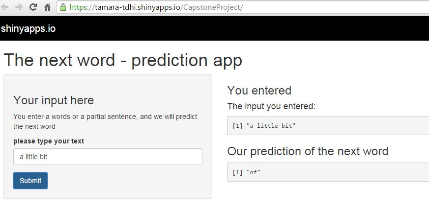

capstone project presentation
========================================================
author: Tamara de Heij
date: April 26, 2015

Goal of the project
========================================================

The goal of the project is to create a Shiny app that takes as input a phrase (multiple words), one clicks submit, and it predicts the next word.

The project consists of different phases

- Getting and cleaning the data
- Building a model
- Deploying this model into a shiny app

I consider this product to be a MVP (minimum viable product) - i.e., it has the core features to be deployed. In the next phases, the model should be optimized to make better predictions.

Approach
========================================================

- Step 1: I created files with word combinations. 4 files with 5, 4, 3 and 2 word combo's. 

- The app uses these files to search in this pattern;
> - First determine number of words as input. If more than 4, take the last 4 
> - => 4 words? Search combo with highest freq in 5 combo-file. Nothing? Go to next step.
> - Repeat previous step (if 3 words --> 4 word combo's, 2 words --> 3 word combo's, 1 word --> 2 word combo's)
> - If nothing was rendered, return nothing

Example
========================================================
The following example searches in the list with 4-word combination for everything starting with "a little bit". The number is the frequency of the word-combination in the training set.


```
     [,1]                [,2]
[1,] "a little bit of"   "43"
[2,] "a little bit more" "5" 
[3,] "a little bit in"   "4" 
[4,] "a little bit too"  "4" 
```

It's sorted descending, so we can pick the fist row as prediction

```
[1] "of"
```

Screenprints
========================================================



Enter your input in the input box on the left side. The results appear in the box on the right, below. 

https://tamara-tdhi.shinyapps.io/CapstoneProject/ 
